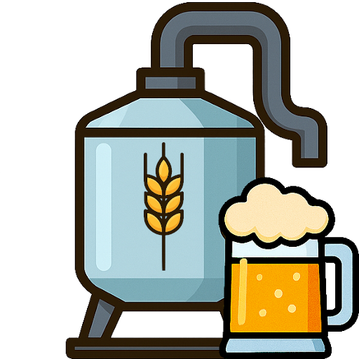
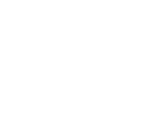
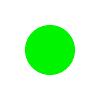
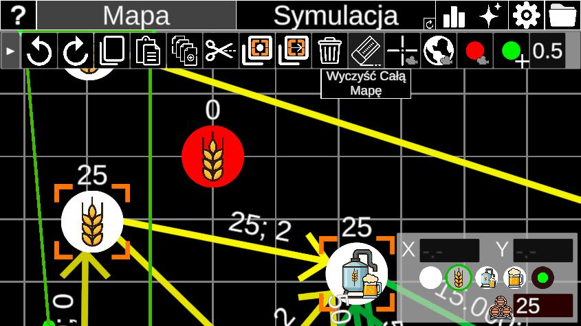
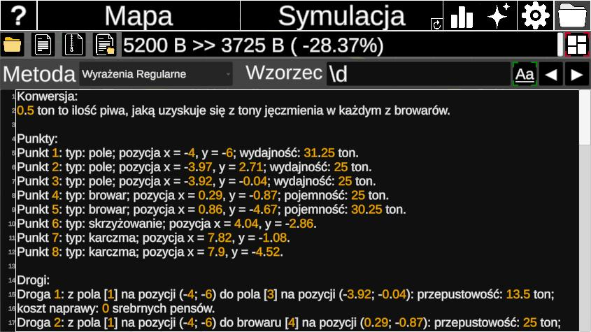

# ShireCraft
Symulator transportu piwa w świecie Hobbitów (projekt zaliczeniowy).

| Ikona | Opis |
|------|------|
|  | Pola, na których Hobbici produkują jęczmień |
|  | Browary, w których jęczmień przetwarzany jest na piwo |
|  | Karczmy, do których ma trafić piwo |
|  | Skrzyżowania |
|  | Drogi między punktami |
|  | Ćwiartki, które wyznaczają ilości jęczmienia na polach |

## Funkcje

1. Wygodne i intuicyjne tworzenie planów połączeń w krainie (w tym: zaznaczanie, kopiuj-wklej, cofnij-przywróć, reset).

2. Odczyt/zapis z/do pliku.
3. Kompresja plików.
4. Wyszukiwanie wzorca w tekście.

4. Analiza połączeń krok-po-kroku, znajdująca trasy o największej przepustowości przy minimalnym koszcie (minimum-cost flow).

5. Generowanie częściowo losowych sieci połączeń.

6. Asynchroniczne działanie.

7. Ustawienia i customizacja.

8. Statystyki mapy i symulacji.

9. Instrukcja obsługi wewnątrz aplikacji.

